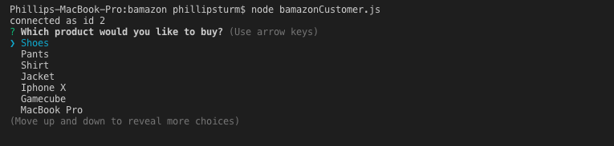
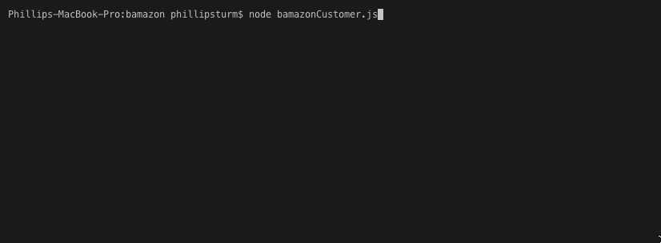
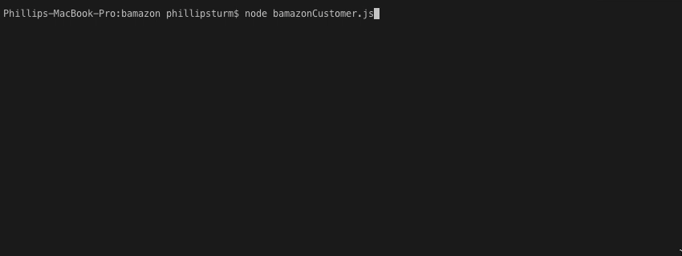

# Bamazon #

## ABOUT ##

Bamazon is the next big marketplace (once Amzazon goes under) that uses MySQL to display items. 

## NPM Modules ##

1. MySql
2. Inquirer

## Functionality ## 

Once you're done installing the above modules, run the program and you will see a concole log if you are connected to the database. If connected, a list of the available items will display. 

By using *inquirer*, the user is ask which item out of the list that they would like to purchase. Once a selection has been made, a follow up question asks the user to input the quantity that they would like. If that quantity is available, the total cost of the item(s) is console logged and the program is finished. 

If your desired quantity isn't available, you have unrealilistic expectations for bamazon. A message will be console logged saying that the desired stock isn't available and the program ends. 

## Updates That Need To Happen ##

I wasn't able to get the stock to update after the user makes their choice, so that will need to be updated. Also having a function to restart the program instead of it ending after either a purchase or insufficiant stock would be nice. 
